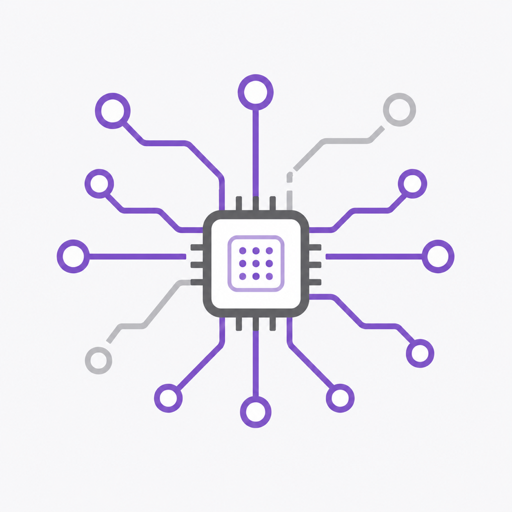

  

<h1 align="center">Tweaker</h1>

  <strong>macOS, trimmed to what you actually use.</strong>

  
  
  

 

Apple ships a Mac as if you need every service they make. Spotlight, Siri, iCloud helpers, Photos analysis, Continuity, widgets, update agents, telemetry — they start with the system and stay in the background whether you asked for them or not.

Most people never touch half of that. The processes still sit in RAM, still wake the disk, still clutter Activity Monitor. The Mac feels busier than it has to.

**Tweaker** is a small native app for turning that extra layer off. You pick the features you don’t use, review the plan, type your administrator password once, and apply. Fewer daemons, less memory, a snappier machine — and the parts of macOS you actually live in stay put.

---

## What it does

### System Tweaker

Walk through the system by category — Search & Intelligence, Siri, Messages, iCloud, Photos, Location, telemetry, and the rest — and keep only what you use.

Each toggle is a real group of `launchd` services, not a single checkbox with no effect. Turn off Spotlight if you search with something else. Drop Apple Intelligence if you never open it. Disable iCloud helpers if this Mac is just a local machine. Related daemons go with the feature, so one decision can take a whole family of background jobs with it.

That is where the RAM and the process count usually come back.

### System Apps

Mail, Maps, Stocks, Freeform, and the other apps Apple parks in `/System/Applications` are glued to the signed system volume. Finder will not let you throw them out.

Tweaker remounts that volume, moves or deletes the apps you don’t want, then blesses a new bootable snapshot. After a restart they are gone from the system you boot — not hidden, not sitting in a trash that SIP will restore.

You can also park an app in a disabled folder and bring it back later, if you are not ready to delete it for good.

### System Debloat

Some of the heaviest things on a modern Mac are not apps. They are downloaded models and asset packs: Apple Intelligence, Siri offline data, translation, dictation, simulator runtimes, extra voices.

If you do not use them, they are just gigabytes on the disk. Tweaker removes those unused system components so the space is yours again. macOS can always download a pack later if you change your mind.

### Security

A separate section for Gatekeeper, XProtect, and system policy. Off if you know why you want them off. On if you don’t. No scavenger hunt through `launchctl`.

### Built like a Mac app

The interface is SwiftUI — sidebar, review sheet, live progress. You collect changes across tabs, then apply them in one pass. The app runs as you; a small helper asks for the administrator password only when it is time to write.

---

## What you should know

Tweaker is a power-user tool. It changes real system state.

- **System Tweaker** can run with SIP on for many user-level agents. System daemons need SIP off.
- **System Apps** need **SIP** and **Authenticated Root** disabled from Recovery, because they rewrite the sealed system volume and create a new snapshot.
- **System Debloat** needs SIP off. Those assets live under `/System/Library`.
- A snapshot change needs a restart. Tweaker can reboot into a clean session so windows do not come back.

If you are not comfortable in Recovery, or you rely on every Apple service on this Mac, this is not the app for that machine.

---

## Requirements

| | |
| --- | --- |
| Mac | Apple Silicon or Intel |
| System | macOS 15 and newer |
| Privileges | Administrator password to apply |
| For system volume edits | SIP and Authenticated Root off |

---

  Keep what you use. Drop the rest.

